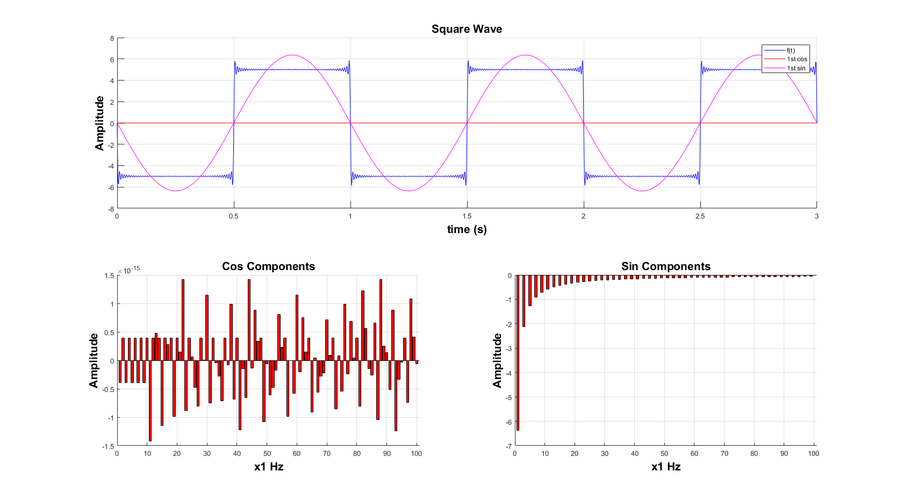

# VAMK-Matlab-Square-Wave
Use the Fourier series expansion to make a square wave from a sum of harmonics. Final project in Mathematical Software course at VAMK

## Usage:
__Simple__ (Using default values): square_wave_project  
__Full__: square_wave_project ([T, [num, [max, [min, [start, [state]]]]]])  
__Options__:
* __T__: time each period (s)
* __num__: number of terms of each component (sin, cos) to compute
* __max__: high value
* __min__: low value
* __start__: starting time (s)
* __state__: starting state (1 for high, 0 for low)

## Screenshots
__Command__: square_wave_project(3,50,300,-300,200,1) 
  
.png)
  
__Command__: square_wave_project  
  

